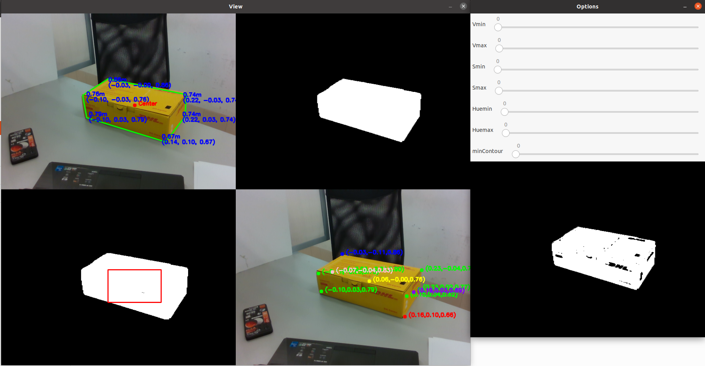

# Parcel Detection and Localization with CAMShift using RealSense D435

This software module enables the detection and localization of a parcel, such as those used by DHL Express, suitable for robotic manipulator grasping in delivery applications. The CAMShift algorithm (Continuously Adaptive Mean-Shift) is employed for object tracking based on HSV (Hue-Saturation-Value) information and depth data from a RealSense D435 camera. The program computes the 3D position of the parcel's corners relative to the camera axes (Z: optical axis, Y: vertical axis downwards, X: horizontal axis right). Two modes are supported: manual bounding box selection for color distribution analysis using a graphical interface and automatic parcel detection using parameters from a configuration file.

## Table of Contents
- [Prerequisites](#prerequisites)
- [Installation](#installation)
- [Usage](#usage)
  - [Running the Program](#running-the-program)
  - [Manual mode](#manual-mode)
  - [Automatic mode](#automatic-mode)
- [Functions Overview](#functions-overview)
  - [Core Functions](#core-functions)
    - [processImage](#processimage)
    - [getBestPolygon](#getbestpolygon)
    - [markVertexDistances](#markvertexdistances)
    - [vertexOrthoedro](#vertexorthoedro)
    - [calcBoxOrientation](#calcboxorientation)
    - [drawVertex](#drawvertex)
  - [Utility Functions](#utility-functions)
    - [isValidPoint](#isvalidpoint)
    - [loadConfigFromXML and saveConfigToXML](#loadconfigfromxml-and-saveconfigtoxml)
    - [adjustROI](#adjustroi)
    - [calculateLongestVector](#calculatelongestvector)
    - [separateVertex](#separatevertex)
    - [movingAverageFilter](#movingAverageFilter)
- [Main Function Structure](#main-function-structure)

## Prerequisites
- [OpenCV](https://opencv.org/)
- [librealsense](https://github.com/IntelRealSense/librealsense)
- [Eigen](https://eigen.tuxfamily.org/dox/GettingStarted.html)
- [tinyxml2](https://github.com/leethomason/tinyxml2)

## Installation

1. Clone the repository:
    ```bash
    git clone https://github.com/JorgePogue37/RealSenseBoxDetection
    cd RealSenseBoxDetection
    cd include
    git clone https://github.com/leethomason/tinyxml2
    cd ..
    ```

2. Build the project:
    ```bash
    mkdir build
    cd build
    cmake ..
    make

## Usage

### Running the Program

To run the program, execute the following command from the `build` directory:
```bash
./RealSenseBoxDetection <mode>
```
Replace <mode> with manual or auto to select the desired mode of operation.

In order to stop the program press the key "esc".

### Manual mode

The manual mode is designed for parameter calibration. In this mode, you will get a graphical interface to configure the HSV parameters and minContour. You can adjust these parameters using the trackbars provided. Once you have configured the parameters, you can save them into the XML file Config.xml by pressing the letter s. This mode allows you to fine-tune the parameters to ensure accurate parcel detection.

You can adjust the following parameters using the trackbars in the GUI:

- `Vmin` and `Vmax`: Minimum and maximum values for the V channel in HSV color space.
- `Smin` and `Smax`: Minimum and maximum values for the S channel in HSV color space.
- `Huemin` and `Huemax`: Minimum and maximum values for the H channel in HSV color space.
- `minContour`: Minimum contour area to consider for object detection.



To start the program in manual mode:

```bash
./RealSenseBoxDetection manual
```

### Automatic mode
In automatic mode, the parameters for HSV and minContour are loaded from the Config.xml file. This mode does not allow you to modify these parameters through the GUI. Instead, it provides an image showing the vertex of the parcel on the color image to check that the detection is working properly. Regardless of the mode, the terminal will display the sizes of the parcel and the vector from the camera to the center of the box in box coordinates.

To start the program in automatic mode:

```bash
./RealSenseBoxDetection auto
```

## Functions Overview

### Core Functions

#### processImage

- **Purpose:** Processes the input image to track the parcel using CAMShift algorithm.
- **Parameters:**
  - `color`: BGR image for processing.
  - `hsv`: Output HSV image.
  - `hue`, `mask`, `backproj`, `edges`: Output matrices for intermediate image processing steps.
  - `trackWindow`: Bounding box for tracking.
  - `hist`: Histogram of hue distribution.
  - `hsize`, `phranges`: Parameters for histogram calculations.
  - `mode`: Operating mode ('manual' or 'automatic').
  - `camshiftbox`: Mask image used in CAMShift processing.
- **Description:** Converts the input image to HSV format, applies color segmentation, tracks the parcel using CAMShift, and uses opencv image processing functions to obtain a mask that isolates the parcel.

#### getBestPolygon

- **Purpose:** Extracts the best polygon approximation from edge-detected contours.
- **Parameters:**
  - `edges`: Binary edge-detected image.
- **Description:** Finds and returns the polygon with best fit to the detected contours.

#### markVertexDistances

- **Purpose:** Computes 3D spatial points corresponding to the vertex of the parcel.
- **Parameters:**
  - `image`: BGR image for displaying depth information.
  - `bestPolygon`: Best polygon approximating the parcel.
  - `depth_frame`, `intr`, `color_stream`, `depth_stream`: RealSense camera parameters.
- **Description:** Uses depth information to compute and mark spatial coordinates of parcel corners on the image.

#### vertexOrthoedro

- **Purpose:** Computes vertex and dimensions of an orthoedron.
- **Parameters:**
  - `box`: Structure containing measured points, rotation matrix, and dimensions.
- **Description:** Calculates vertex, dimensions, and center of the parcel in 3D space.

#### calcBoxOrientation

- **Purpose:** Calculates the orientation of the parcel.
- **Parameters:**
  - `box`: Structure containing measured points and rotation matrix.
- **Description:** Determines the rotational matrix for aligning the parcel with the camera's coordinate system.

#### drawVertex

- **Purpose:** Draws projected vertex and reference points on the image.
- **Parameters:**
  - `image`: Output image with projected vertex.
  - `box`: Structure containing vertex and rotation matrix.
  - `intr`: RealSense camera intrinsics.
- **Description:** Projects and visualizes parcel vertex and reference points on the image.

### Utility Functions

#### isValidPoint

- **Purpose:** Checks if a given point is valid within the frame dimensions.
- **Parameters:**
  - `pt`: Point to be validated.
  - `depth_frame`: Depth frame from RealSense camera.
- **Description:** Verifies if the point is within the valid frame dimensions.

#### loadConfigFromXML and saveConfigToXML

- **Purpose:** Load and save configuration parameters from/to an XML file.
- **Parameters:**
  - `filename`: Path to the XML configuration file.
- **Description:** Loads and saves HSV and contour parameters from/to an XML configuration file.

#### adjustROI

- **Purpose:** Adjusts the region of interest (ROI) to ensure it remains within the image bounds.
- **Parameters:**
  - `roi`: Current region of interest.
  - `imgSize`: Size of the input image.
- **Description:** Ensures the ROI stays within valid image dimensions.

#### calculateLongestVector

- **Purpose:** Finds the longest vector sum among sequential triplets in a given set of 3D vectors.
- **Parameters:**
  - `vertex`: A vector containing 3D points (`Eigen::Vector3d`) representing vertex.
- **Returns:** The longest vector sum found among the sequential triplets.
- **Description:** This function iterates through the list of vertex, computes the sum of vectors for each sequential triplet, and returns the vector sum with the longest magnitude. It is used in `calcBoxOrientation` to determine the primary vector direction for orientation calculation.

#### separateVertex

- **Purpose:** Separates vertex into two groups based on their relative position to an average vector.
- **Parameters:**
  - `vertex`: A vector containing 3D points (`Eigen::Vector3d`) representing vertex.
  - `avgVector`: Average vector direction used for separation.
  - `sideA`, `sideB`: Output vectors to store vertex separated into two groups.
  - `centroid`: Centroid point around which separation is performed.
- **Description:** This function categorizes vertex into two groups (`sideA` and `sideB`) based on their dot product with `avgVector`. vertex with a positive dot product are added to `sideA`, while those with a non-positive dot product are added to `sideB`. It assists in organizing vertex for further processing in `calcBoxOrientation`.

#### movingAverageFilter

- **Purpose:** Applies a moving average filter to smooth the 3D positions of parcel vertex points.
- **Parameters:**
  - `points`: A deque of `Eigen::Vector3d` representing a sequence of 3D points.
- **Returns:** The filtered 3D point, computed as the average of the last window points in the deque.
- **Description:** This function computes the moving average of the most recent 3D points (10 points as default) in the points deque. The result is a smoothed point that reduces noise in the detected parcel's position. This is useful for stabilizing the detected position of the parcel over multiple frames, especially when there is jitter or fluctuation in the measurements.


## Main Function Structure

```cpp
#include <opencv2/opencv.hpp>
#include <librealsense2/rs.hpp>
#include <Eigen/Dense>
#include <iostream>
#include <iomanip>
#include "tinyxml2.h"

using namespace cv;
using namespace std;
using namespace Eigen;

// Global variables and constants

// Function prototypes

int main(int argc, char** argv) {
    // Initialize RealSense camera and other necessary components

    // Main loop for capturing frames
    
    // Image processing and parcel detection using CAMshift (processImage)

    // Get the best adjusted polygon to the contour of the parcel (getBestPolygon)

    // Calculate the distances to the vertex of this polygon which are the corners of the box (markVertexDistances)

    // Calculate parcel Orientation based on the vectors to the points calculated on the previous function (calcBoxOrientation)

    // Calculate the vectors to the corners of the parcel using the information obtained from the previous functions. It also calculate the size of the parcel, grasping points on the center of the sides of the parcel and it's center (vertexOrthoedro)

    // Calculate the filtered point using a moving average filter. Then, points that are further than a certain distance (default is 0.1) are substituted with the previous point, and the filtered point is recalculated with the updated set.
    
    // Display results and user interface for manual selection
    
    // Clean up and release resources
    
    return 0;
}
```
