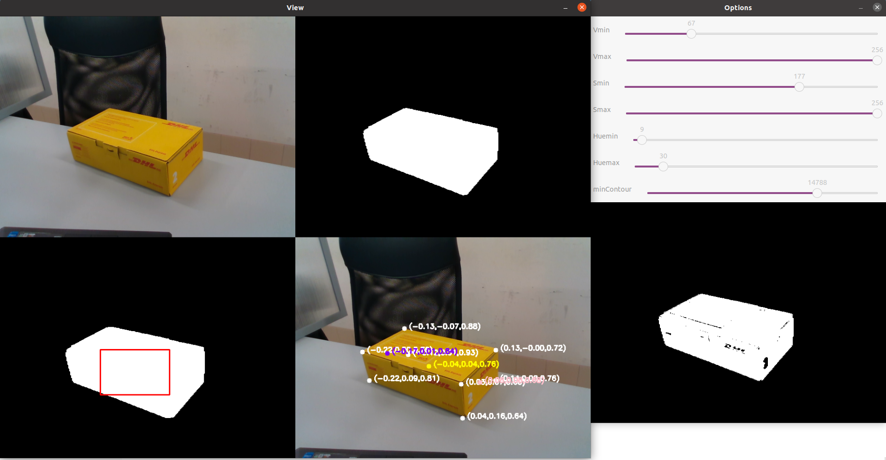

# 3D Box Detection and Orientation Estimation with Intel RealSense

This repository provides a C++ implementation for detecting and estimating the orientation of 3D boxes using an Intel RealSense camera. The project leverages advanced libraries such as OpenCV, Eigen, and Open3D to process image data and point clouds, allowing for accurate box recognition and real-time orientation estimation.

## Table of Contents
- [Prerequisites](#prerequisites)
- [Installation](#installation)
- [Usage](#usage)
  - [Running the Program](#running-the-program)
  - [Manual mode](#manual-mode)
  - [Automatic mode](#automatic-mode)
  - [log File](#log-file)
- [Functions Overview](#functions-overview)
  - [Core Functions](#core-functions)
    - [processImage](#processimage)
    - [getCloud](#getcloud)
    - [filterPointCloud](#filterpointcloud)
    - [calculateBoxParameters](#calculateboxparameters)
    - [drawVertex](#drawvertex)
  - [Utility Functions](#utility-functions)
    - [isValidPoint](#isvalidpoint)
    - [loadConfigFromXML and saveConfigToXML](#loadconfigfromxml-and-saveconfigtoxml)
    - [adjustROI](#adjustroi)
    - [rotateCloud](#rotatecloud)
    - [visualizePointCloud](#visualizepointcloud)
    - [getCurrentTimeInMilliseconds](#getcurrenttimeinmilliseconds)
- [Main Function Structure](#main-function-structure)

## Prerequisites
- [OpenCV](https://opencv.org/)
- [librealsense](https://github.com/IntelRealSense/librealsense)
- [Eigen](https://eigen.tuxfamily.org/dox/GettingStarted.html)
- [tinyxml2](https://github.com/leethomason/tinyxml2)
- [Open3D](https://www.open3d.org/docs/latest/compilation.html#compilation)

## Installation

1. Clone the repository:
    ```bash
    git clone https://github.com/grvc-robotics-lab/RealSenseBoxDetection
    cd RealSenseBoxDetection
    cd include
    git clone https://github.com/leethomason/tinyxml2
    cd ..
    ```

2. Build the project:
    ```bash
    mkdir build
    cd build
    cmake ..
    make

## Usage

### Running the Program

To run the program, execute the following command from the `build` directory:
```bash
./RealSenseBoxDetection <mode>
```
Replace `mode` with `manual` or `auto` to select the desired mode of operation.

In order to stop the program press the key "esc".

### Manual mode

The manual mode is designed for parameter calibration. In this mode, you will get a graphical interface to configure the HSV parameters and minContour. You can adjust these parameters using the trackbars provided. Once you have configured the parameters, you can save them into the XML file Config.xml by pressing the letter s. This mode allows you to fine-tune the parameters to ensure accurate parcel detection.

You can adjust the following parameters using the trackbars in the GUI:

- `Vmin` and `Vmax`: Minimum and maximum values for the V channel in HSV color space.
- `Smin` and `Smax`: Minimum and maximum values for the S channel in HSV color space.
- `Huemin` and `Huemax`: Minimum and maximum values for the H channel in HSV color space.
- `minContour`: Minimum contour area to consider for object detection.



To start the program in manual mode:

```bash
./RealSenseBoxDetection manual
```

### Automatic mode
In automatic mode, the parameters for HSV and minContour are loaded from the Config.xml file. This mode does not allow you to modify these parameters through the GUI. Instead, it provides an image showing the vertex of the parcel on the color image to check that the detection is working properly. Regardless of the mode, the terminal will display the sizes of the parcel and the vector from the camera to the center of the box in box coordinates.

To start the program in automatic mode:

```bash
./RealSenseBoxDetection auto
```

### log file
A CSV log file ("points_log.csv") containing the calculated reference points with their assigned timestamps is generated. This is useful for analyzing the evolution of the detected reference points over time, allowing post-processing in external tools like MATLAB or Python for further data analysis, filtering, or debugging purposes. The time mark helps correlate the point positions with specific moments during the detection process.

## Functions Overview

### Core Functions

#### processImage

- **Purpose:** Processes the input image to track the parcel using CAMShift algorithm.
- **Parameters:**
  - `color`: BGR image for processing.
  - `hsv`: Output HSV image.
  - `hue`, `mask`, `backproj`, `edges`: Output matrices for intermediate image processing steps.
  - `trackWindow`: Bounding box for tracking.
  - `hist`: Histogram of hue distribution.
  - `hsize`, `phranges`: Parameters for histogram calculations.
  - `mode`: Operating mode ('manual' or 'automatic').
  - `camshiftbox`: Mask image used in CAMShift processing.
- **Description:** Converts the input image to HSV format, applies color segmentation, tracks the parcel using CAMShift, and uses opencv image processing functions to obtain a mask that isolates the parcel.

#### getCloud

- **Purpose:** Creates the point cloud with the points that are considered to be part of the parcel.
- **Parameters:**
  - `edges`: A matrix where each pixel indicates if it's part of the parcel (value 255 for parcel points).
  - `depth_frame`: The depth data for each pixel, used to project 2D pixel coordinates into 3D.
  - `intrinsics`: RealSense camera intrinsics for projecting 2D pixels into 3D space.
  - `box`: Structure containing a point cloud to which the function adds the 3D points.
- **Description:** Converts the points that are marked as part of the parcel into a 3D point cloud. The function checks each pixel in the depth frame, and if it's part of the parcel (marked in the edges matrix), it calculates the 3D coordinates and adds them to the point cloud in `box.measuredPoints`. It leverages the camera's depth data and intrinsics to transform 2D pixel data into a 3D representation of the parcel points.

#### filterPointCloud

- **Purpose:** Filters the point cloud by downsampling, removing outliers, and segmenting the main plane from the parcel. It also constructs a new, filtered point cloud by identifying planes, rotating the clouds to align them properly, and adding points from the detected planes.
- **Parameters:** 
  - `box`: An `orthoedro` object containing the point cloud (`measuredPoints`, `filteredCloud`, etc.), which will be processed and refined.
- **Description:** This function performs several operations on the point cloud data stored in `box.measuredPoints` to refine and filter the 3D representation of the parcel:
  1. **Downsampling:** The point cloud is first downsampled using a voxel grid to reduce the number of points while preserving the overall structure.
  
  2. **Plane Segmentation:** The function then attempts to segment the primary plane of the parcel using the RANSAC algorithm. It uses a specified distance threshold and RANSAC iterations to identify the inliers (points on the plane).
  
  3. **Rotation:** Once the plane is identified, the cloud is rotated to align with a target axis, ensuring that the planes are properly oriented.
  
  4. **Outlier Removal:** After segmenting the plane, the function removes noise and outliers from the point cloud using a radius-based outlier removal method. It attempts to ensure that only the points belonging to the parcel or relevant surfaces are kept.
  
  5. **Additional Plane Segmentation:** The function continues by finding secondary planes within the remaining point cloud. These planes are added to `box.filteredCloud`.
  
  6. **Plane Projection and Coloring:** For each point on the main plane, the function projects points to the minimum and maximum z-axes (defining the boundaries of the parcel in the z-direction).
  
  7. **Final Rotation:** The clouds are rotated back to their original orientation to maintain consistency with the original depth frame data.

    By the end of this process, the `box.filteredCloud` contains a cleaner and more precise point cloud that represents the parcel and its planes, with noise and outliers removed.

#### calculateBoxParameters

- **Purpose:** Calculates the dimensions (height, width, and length) of the parcel's bounding box and identifies reference points that define the left and right sides of the parcel.

- **Parameters:**
  - `box`: An `orthoedro` object containing the filtered point cloud and other attributes, such as the oriented bounding box (`obb`), vertices, and reference points.

- **Description:** This function processes the point cloud stored in `box.filteredCloud` and performs the following key steps:

1. **Bounding Box Calculation:** The function first computes the minimal oriented bounding box (`obb`) of the point cloud, which encloses the parcel with minimal volume. It extracts the vertices of the box (`box.vertex`) and calculates its center.

2. **Dimensions Calculation:** The function calculates the distances between specific vertices to determine the three dimensions (height, width, and length) of the bounding box.

3. **Reference Points Calculation:** The function calculates two reference points (`ref1` and `ref2`) to define the left and right sides of the parcel.
   
4. **Left and Right Side Assignment:** Once `ref1` and `ref2` are identified, the function compares their x-coordinates. If `ref1` has a larger x-value, it is assigned to the left side (`refPointLeftside`), and `ref2` to the right side (`refPointRightside`). Otherwise, the assignment is reversed. This ensures the proper orientation of the parcel based on its spatial position.

  In summary, this function extracts the geometric characteristics of the parcel's bounding box and provides key reference points to describe the position and orientation of the parcel.

#### drawVertex

- **Purpose:** Draws projected vertex and reference points on the image.
- **Parameters:**
  - `image`: Output image with projected vertex.
  - `box`: Structure containing vertex and rotation matrix.
  - `intr`: RealSense camera intrinsics.
- **Description:** Projects and visualizes parcel vertex and reference points on the image.

### Utility Functions

#### isValidPoint

- **Purpose:** Checks if a given point is valid within the frame dimensions.
- **Parameters:**
  - `pt`: Point to be validated.
  - `depth_frame`: Depth frame from RealSense camera.
- **Description:** Verifies if the point is within the valid frame dimensions.

#### loadConfigFromXML and saveConfigToXML

- **Purpose:** Load and save configuration parameters from/to an XML file.
- **Parameters:**
  - `filename`: Path to the XML configuration file.
- **Description:** Loads and saves HSV and contour parameters from/to an XML configuration file.

#### adjustROI

- **Purpose:** Adjusts the region of interest (ROI) to ensure it remains within the image bounds.
- **Parameters:**
  - `roi`: Current region of interest.
  - `imgSize`: Size of the input image.
- **Description:** Ensures the ROI stays within valid image dimensions.
  
#### rotateCloud

- **Purpose:** This function rotates a point cloud so that the normal of the input plane model aligns with a specified target axis (by default, the z-axis). This is useful for aligning a detected plane (e.g., the surface of a box) to a standard orientation.
- **Parameters:** 
  - `cloud`: A shared pointer to the `open3d::geometry::PointCloud` object that will be rotated. This is the input point cloud representing the 3D data to be aligned.
  - `plane_model`: A 4D vector `Eigen::Vector4d` representing the coefficients of the plane equation in the form [a, b, c, d], where [a, b, c] is the plane normal.
  - `inverse`: A boolean flag. If true, the point cloud will be rotated in the reverse direction.
  - `target_axis`: An optional 3D vector (Eigen::Vector3d) representing the axis to which the plane normal should be aligned. By default, it is set to (0, 0, 1) which corresponds to the z-axis.
- **Description:** The function rotates the point cloud so that the normal of the input plane model aligns with a specified target axis (by default, the z-axis). The process involves the following steps:

1. **Extract the Plane Normal**:
The function extracts the normal vector from the input plane_model vector, which represents the orientation of the plane in 3D space.

2. **Compute the Rotation Axis**:
The rotation axis is calculated as the cross product of the plane normal and the target axis. This axis represents the direction around which the point cloud will be rotated to align the plane with the target axis.

3. **Calculate the Rotation Angle**:
The angle between the plane normal and the target axis is computed using the dot product formula. This angle tells us how much rotation is required to align the plane normal with the target axis. If the inverse flag is set to true, the rotation angle is negated to apply the inverse rotation.

4. **Apply the Rotation**:
The function checks if the computed rotation axis is valid (i.e., it has a non-zero norm). If valid, the rotation matrix is calculated using the `Eigen::AngleAxisd` class, and the point cloud is rotated around the computed axis by the calculated angle using the `cloud->Rotate()` function from Open3D.

  This function does not return any values. It modifies the input point cloud `cloud` in place, applying the calculated rotation to align the plane normal with the target axis.

#### movingAverageFilter

- **Purpose:**  This function computes the moving average of the last `window` points in the given deque of 3D vectors (`Eigen::Vector3d`). It averages the most recent points to reduce noise and smooth out variations in the data.
- **Parameters:**
  - `points`: A deque of 3D vectors `Eigen::Vector3d` representing a sequence of 3D points. The deque contains all the previous points, with newer points appended at the end.
- **Return**: A smoothed 3D point `Eigen::Vector3d` which is the average of the last `window` points in the deque. If there are fewer than `window` points in the deque, it averages all the available points.

#### visualizePointCloud

- **Purpose:** Function to visualize the point cloud and bounding box in 3D space using Open3D.
- **Parameters:**
  - `box`:  A reference to an `orthoedro` object, which contains the oriented bounding box (`obb`), the filtered point cloud (`filteredCloud`), and the remaining point cloud (`remaining_cloud`). These are used to create the geometries to be visualized. 
- **Description:** This function creates a collection of geometries, including the oriented bounding box (OBB), the filtered point cloud, and the remaining point cloud, and visualizes them in a 3D viewer using Open3D's visualization tools.

#### getCurrentTimeInMilliseconds

- **Purpose**: Function that returns the current time in milliseconds.

## Main Function Structure

```cpp
#include <opencv2/opencv.hpp>
#include <librealsense2/rs.hpp>
#include <Eigen/Dense>
#include <iostream>
#include <iomanip>
#include "tinyxml2.h"

using namespace cv;
using namespace std;
using namespace Eigen;

// Global variables and constants

// Function prototypes

int main(int argc, char** argv) {
    // Initialize RealSense camera and other necessary components

    // Main loop for capturing frames
    
    // Image processing and parcel detection using CAMshift (processImage)

    // Generate the point cloud whith the points that have been determined to be part of the parcel by processImage (getCloud)

    // Filter the point cloud to remove outliers and generate a 3D model of the parcel (filterCloud)

    // Calculate parcel minimal ortiented bounding box and extract relevant information out of it (calculateBoxParameters)
    
    // Display results and user interface for manual selection
    
    // Clean up and release resources
    
    return 0;
}
```
